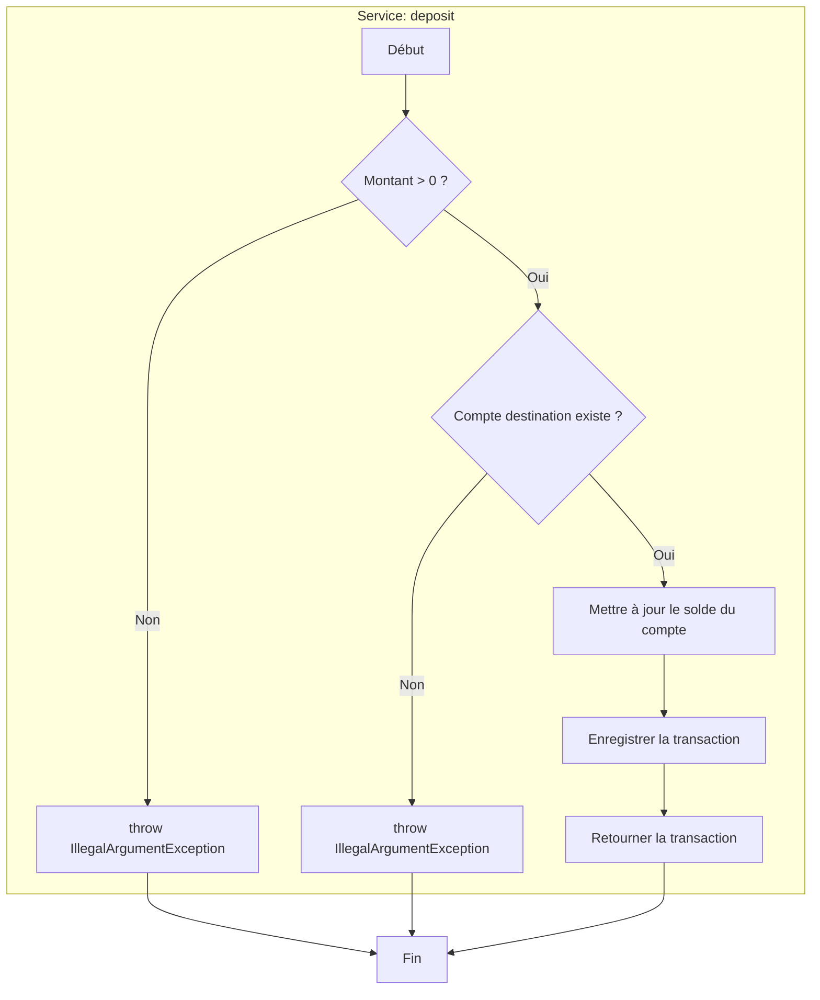

# Graphe de Contrôle de Flux (CFG) pour le Service `deposit`

## Description du Flux Abstrait

1.  **A (Début)** : L'opération de dépôt commence.
2.  **B (Validation Montant)** : Vérifie si le montant à déposer est strictement positif.
3.  **C (Exception Montant Invalide)** : Si le montant est négatif ou nul, une exception est levée car un dépôt doit augmenter le solde.
4.  **D (Validation Compte)** : Vérifie si le compte destinataire spécifié existe dans le système.
5.  **E (Exception Compte Invalide)** : Si le compte n'est pas trouvé, une exception est levée pour notifier l'erreur.
6.  **F (Mise à jour Solde)** : Si les vérifications passent, le solde du compte est augmenté du montant du dépôt.
7.  **G (Enregistrement Transaction)** : Une nouvelle transaction de type "Dépôt" est créée et sauvegardée pour l'historique.
8.  **H (Retour)** : La transaction enregistrée est retournée pour confirmer que l'opération a réussi.
9.  **Z (Fin)** : L'opération se termine, soit avec succès, soit par une exception.
