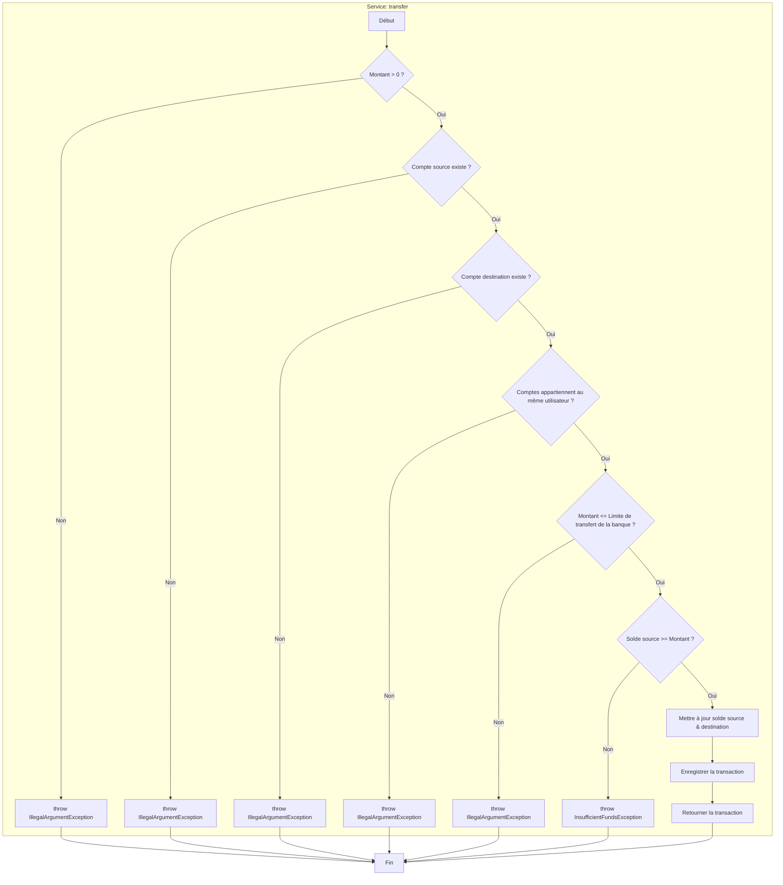

# Graphe de Contrôle de Flux (CFG) pour le Service `transfer`

## Description du Flux Abstrait

1.  **A (Début)** : L'opération de transfert commence.
2.  **B (Validation Montant)** : Vérifie si le montant est positif.
3.  **C (Exception Montant)** : Si non, lève une exception.
4.  **D (Validation Compte Source)** : Vérifie l'existence du compte source.
5.  **E (Exception Compte Source)** : Si non trouvé, lève une exception.
6.  **F (Validation Compte Destination)** : Vérifie l'existence du compte de destination.
7.  **G (Exception Compte Destination)** : Si non trouvé, lève une exception.
8.  **H (Validation Propriétaire)** : Vérifie que les deux comptes appartiennent au même utilisateur.
9.  **I (Exception Propriétaire)** : Si non, lève une exception (règle métier).
10. **J (Validation Limite Banque)** : Vérifie si le montant respecte la limite de transfert de la banque.
11. **K (Exception Limite)** : Si la limite est dépassée, lève une exception.
12. **L (Validation Solde)** : Vérifie si le solde du compte source est suffisant.
13. **M (Exception Solde)** : Si insuffisant, lève une exception.
14. **N (Mise à jour Soldes)** : Débite le compte source et crédite le compte destination.
15. **O (Enregistrement)** : Crée et sauvegarde une transaction de type "Transfert".
16. **P (Retour)** : Retourne la transaction pour confirmer le succès.
17. **Z (Fin)** : L'opération se termine.
