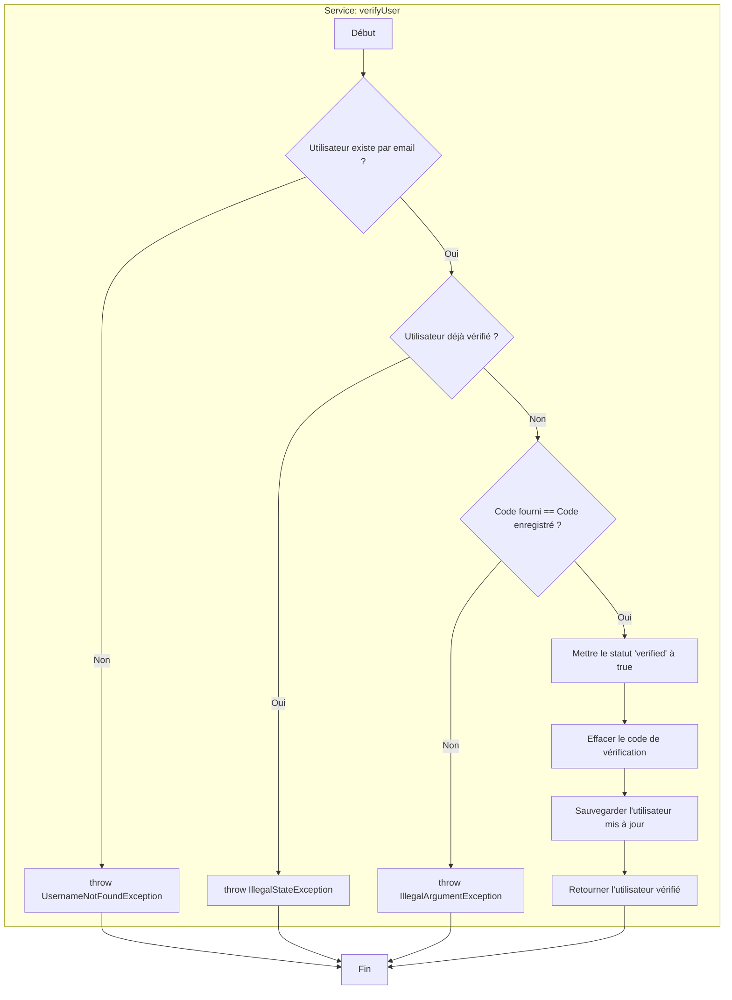

# Graphe de Contrôle de Flux (CFG) pour le Service `verifyUser`

## Description du Flux Abstrait

1.  **A (Début)** : Le processus de vérification de l'utilisateur commence.
2.  **B (Validation Utilisateur)** : Recherche l'utilisateur dans la base de données via son adresse email.
3.  **C (Exception Utilisateur Inconnu)** : Si aucun utilisateur n'est trouvé, une exception est levée.
4.  **D (Validation Statut)** : Vérifie si le compte de l'utilisateur est déjà marqué comme "vérifié".
5.  **E (Exception Déjà Vérifié)** : Si c'est le cas, une exception est levée pour indiquer que l'action est redondante.
6.  **F (Validation Code)** : Compare le code fourni par l'utilisateur avec celui qui est stocké en base de données.
7.  **G (Exception Code Incorrect)** : Si les codes ne correspondent pas, une exception est levée.
8.  **H (Mise à jour Statut)** : Si le code est correct, le statut de l'utilisateur (`verified`) est mis à `true`.
9.  **I (Nettoyage Code)** : Le code de vérification est effacé de la base de données pour des raisons de sécurité et pour qu'il ne soit pas réutilisé.
10. **J (Sauvegarde)** : Les modifications apportées à l'entité utilisateur sont sauvegardées.
11. **K (Retour)** : L'entité `BankUser` mise à jour et maintenant vérifiée est retournée.
12. **Z (Fin)** : Le processus de vérification est terminé.
