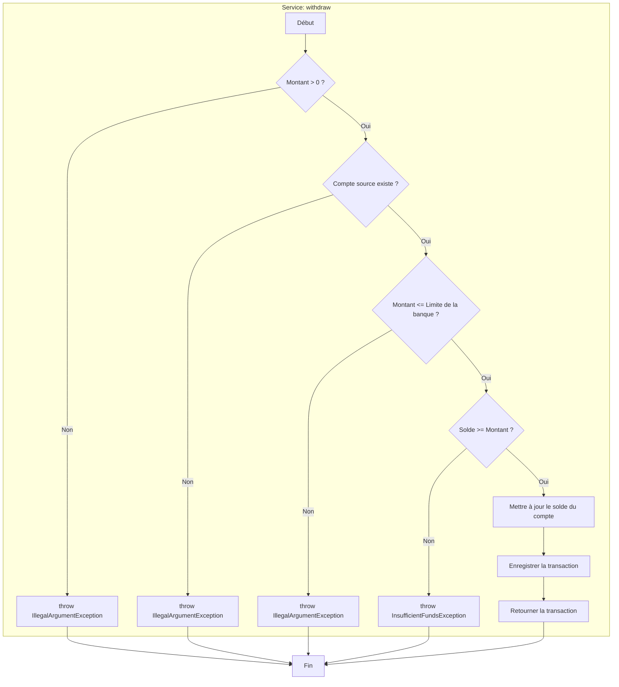

# Graphe de Contrôle de Flux (CFG) pour le Service `withdraw`

## Description du Flux Abstrait

1.  **A (Début)** : L'opération de retrait commence.
2.  **B (Validation Montant)** : Vérifie si le montant à retirer est positif.
3.  **C (Exception Montant Invalide)** : Si le montant est négatif ou nul, une exception est levée.
4.  **D (Validation Compte)** : Vérifie si le compte source spécifié existe dans le système.
5.  **E (Exception Compte Invalide)** : Si le compte n'est pas trouvé, une exception est levée.
6.  **F (Validation Limite Banque)** : Vérifie si le montant du retrait ne dépasse pas la limite autorisée par la banque du compte.
7.  **G (Exception Limite Dépassée)** : Si la limite est dépassée, une exception est levée.
8.  **H (Validation Solde)** : Vérifie si le solde du compte est suffisant pour couvrir le retrait.
9.  **I (Exception Fonds Insuffisants)** : Si le solde est insuffisant, une exception est levée.
10. **J (Mise à jour Solde)** : Si toutes les vérifications passent, le solde du compte est diminué du montant du retrait.
11. **K (Enregistrement Transaction)** : Une nouvelle transaction de type "Retrait" est créée et sauvegardée.
12. **L (Retour)** : La transaction enregistrée est retournée pour confirmer le succès de l'opération.
13. **Z (Fin)** : L'opération se termine, soit avec succès, soit par une exception.
